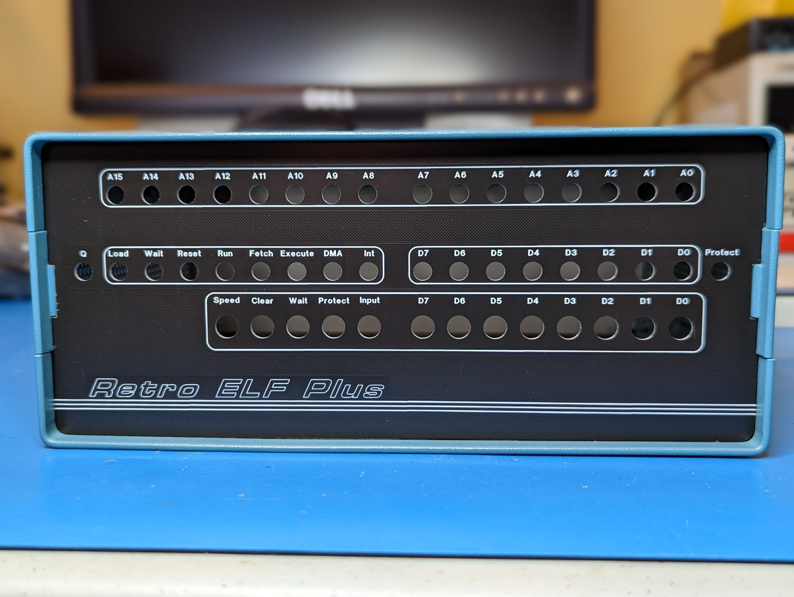
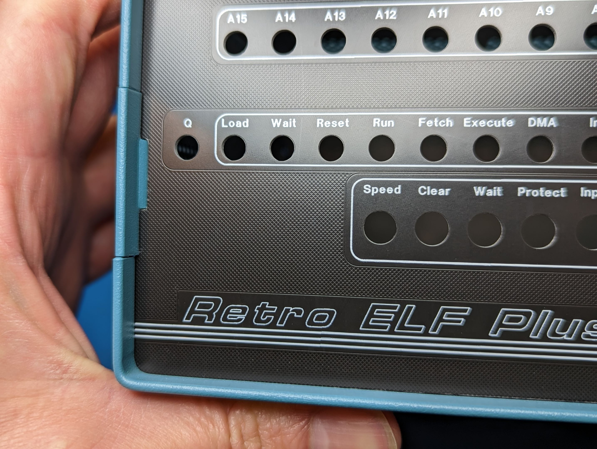

A PCB front panel for Dave Runkle's [Retro Elf](http://www.astrorat.com/cosmacelf/retroelfproject.html) project. The panel is based on Ed Keffe's original [Front Panel Express](https://www.frontpanelexpress.com/) design, but reworked to be much cheaper to produce by any PCB fab and sized to fit in the [Cheval SALB2.0D1W1](https://www.amazon.com/dp/B09MK1Z7K7) enclosure. I did mine at [JLCPCB](https://jlcpcb.com/) in their 1.6mm single sided aluminum board process.  If you run your own, make sure to specifiy order number removal and paper between boards (a couple bucks extras) and expect one or two boards to have small visual defects so order extra if you want a close to perfect one as possible with this process. Just remember you are paying 10's of dollars not $150 from Front Panel Express so calibrate expectations accordingly. I'm super happy with the way these turned out and are far nicer than I could have produced by hand (and no drilling!).

